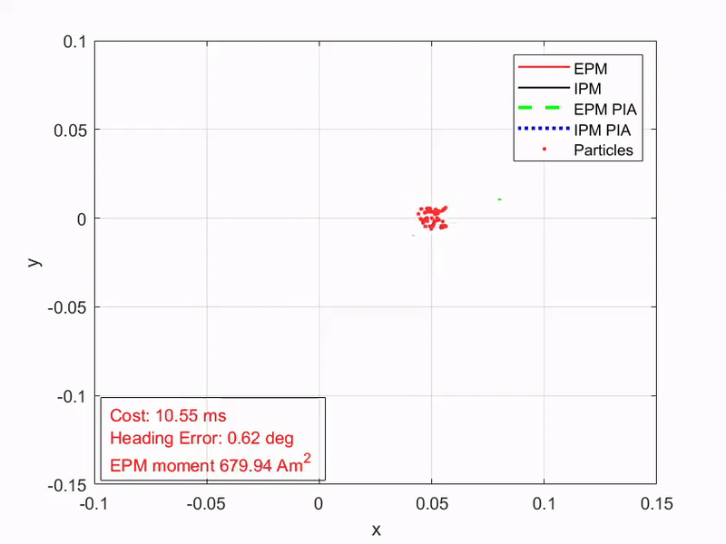
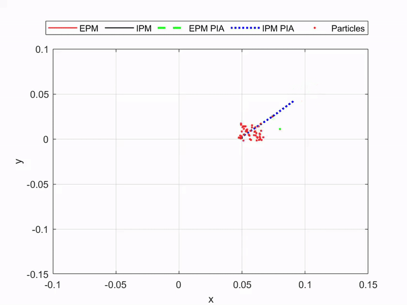
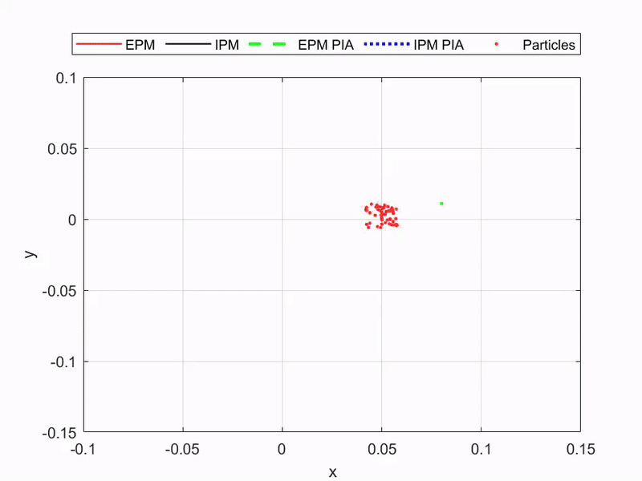

# Particle Importance Analysis (PIA) - Demo
PIA - A Fast Localization Method Under Indeterminate Magnetic Sources

This repository contains a demo program for **Particle Importance Analysis (PIA)**, an algorithm designed for efficient localization using Hall sensor data. PIA is capable of localizing a **target magnet (IPM)** in the presence of **external magnetic interference (EMSs/EMs/EPMs)**, without requiring prior knowledge of the dipole moments of the surrounding magnetic sources.

Instead of explicitly subtracting external fields, PIA directly infers the position of the target magnet while simultaneously estimating the dipole moments of interfering sources, enabling **robust and accurate localization in complex magnetic environments**.

## 🧪 Usage

To run the demo:

1. Make sure the file `pia_est.p` is located in the **same folder** as `PIA_DEMO.m`.
2. Open MATLAB (tested on version 2022a and above).
3. Run the main script:

    ```matlab
    PIA_DEMO
    ```

> ✅ Tested on MATLAB 2022a+. It may also work on earlier versions, but compatibility is not guaranteed.

## 📺 Demo & Highlights

These examples highlight the core strengths of the PIA algorithm:

- **High Computational Efficiency**  
  

- **Robust to Inaccurate Initial Guess**  
  

- **Strong Robustness Against Noise and Disturbance**  
  10% noise on sensor readings
  

## 📄 Source Code Release

All source code will be made publicly available after the corresponding paper is officially published. Stay tuned!